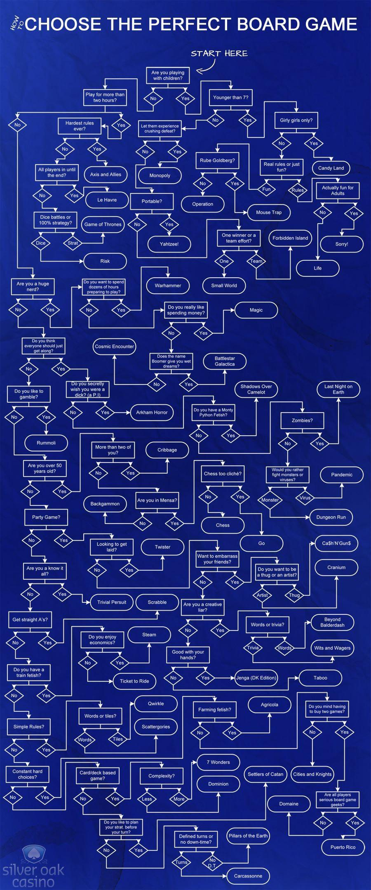

# Board Games

## 2-players board games to try

* [Hive](https://www.boardgamearena.com/gamepanel?game=hive)
* Spirit Island
* The Captain Is Dead
* The Crew

## Resources

### Articles

* [18 Best Two-Player Board Games 2021](https://www.thestrategist.co.uk/article/best-two-player-board-games.html) - The Strategist
* [How to play board games online with your friends](https://masilotti.com/play-board-games-online/) - Joe Masilotti ([HN thread](https://news.ycombinator.com/item?id=22967716))

### Infographics

.png>)

### Lists

* [Spiel des Jahres Awards](https://www.wikiwand.com/en/Spiel\_des\_Jahres)

### Reddit

* [r/boardgames](https://www.reddit.com/r/boardgames/)
* [r/digitaltabletop](https://www.reddit.com/r/digitaltabletop/)
* [Where to play boardgames online](https://www.reddit.com/r/boardgames/wiki/play\_online)
* Threads
  * [What’s the best board game to play with GF, who’s never played board games before?](https://www.reddit.com/r/boardgames/comments/q9azxj/whats\_the\_best\_board\_game\_to\_play\_with\_gf\_whos/)
  * [What’s the best game you added to your collection this year?](https://www.reddit.com/r/boardgames/comments/ko2i2p/whats\_the\_best\_game\_you\_added\_to\_your\_collection/)
  * [What was the game that turned you into a board gamer?](https://www.reddit.com/r/boardgames/comments/lq6r38/what\_was\_the\_game\_that\_turned\_you\_into\_a\_board/)

### Venues

* [Bad Moon Cafè](https://www.badmooncafe.co.uk/) - Borough, London
* [Draughts](https://www.draughtslondon.com/) - Hackney/Waterloo, London

### Websites

* [BoardGameArena](https://boardgamearena.com/)
* [BoardGameGeek](https://boardgamegeek.com/)
* [netgames.io](https://netgames.io/games/) - Social games for your phone
* [Tabletopia](https://tabletopia.com/)

