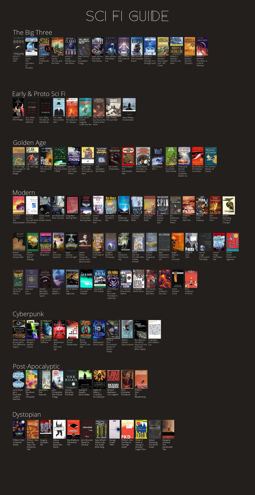

# Books

## Resources

### Articles

* [100 Books To Read In A Lifetime](https://www.amazon.co.uk/100-best-books/b?ie=UTF8\&node=4656884031) - Amazon UK
* [How to Read a Book](https://www.artofmanliness.com/articles/how-to-read-a-book/) - The Art of Manliness
* [How to Remember What You Read](https://fs.blog/2021/08/remember-books/) - Farnam Street
* [Is this a good book for me, now?](https://maryrosecook.com/blog/post/is-this-a-good-book-for-me-now) - Mary Rose Cook
* [The 100 best books of the 21st century](https://www.theguardian.com/books/2019/sep/21/best-books-of-the-21st-century) - The Guardian
* [The Need to Read](http://paulgraham.com/read.html) - Paul Graham
* [Top 100 Books](https://www.alistofbooks.com/lists/10-top-100-books-by-newsweek) - Newsweek
* [Top 100 Books](https://www.bbc.co.uk/arts/bigread/top100.shtml) - The Big Read, BBC

### Book Clubs

* [Engineering Book Club](https://www.engineeringbookclub.com/)
* [Rebel Book Club](https://www.rebelbook.club/)

### Books

* [How To Read A Book](https://smile.amazon.co.uk/dp/0671212095/) - Mortimer Adler, Charles Van Doren

### Bookshelves

* [Alex Vermeer](https://alexvermeer.com/bookshelf/)
* [Bill Gates](https://www.gatesnotes.com/Books)
* [Derek Sivers](https://sive.rs/book)
* [HN Reads](https://hnreads.com/)
  * [Top 40 books of 2023](https://hnreads.com/post/top40_2023/)
* [James Clear](https://jamesclear.com/best-books)
  * [Book Summaries](https://jamesclear.com/book-summaries)
* [Jordan Peterson](https://www.jordanbpeterson.com/great-books/)
* [Mark Manson](https://markmanson.net/best-books)
* [Michael Lynch](https://mtlynch.io/book-reports/)
* [Mind Expanding Books](https://books.vishnuks.com/) ([GitHub](https://github.com/hackerkid/Mind-Expanding-Books))
* [Patrick Collison](https://patrickcollison.com/bookshelf)
* [Rebel Book Club](https://rebelbook.club/library/)
* [The Kurzweil Library](https://www.thekurzweillibrary.com/good-books)

### Hacker News Threads

* [Best books read in 2022?](https://news.ycombinator.com/item?id=33849267)
* [Books you read in 2022 and recommend for 2023](https://news.ycombinator.com/item?id=34160611)
* [Books you read in 2023 and recommend for 2024?](https://news.ycombinator.com/item?id=38556188)
* [Do you read books regularly? Fiction or nonfiction?](https://news.ycombinator.com/item?id=26593122)
* [Extracting Hacker News Book Recommendations with the ChatGPT API](https://blog.reyem.dev/post/extracting_hn_book_recommendations_with_chatgpt_api/)
* [Favorite Nonfiction Books of 2021?](https://news.ycombinator.com/item?id=29507085)
* [Life Changing Books?](https://news.ycombinator.com/item?id=29605394)
* [What's the "best" book you've ever read?](https://news.ycombinator.com/item?id=41756432)
* [What's the best book you read in 2021?](https://news.ycombinator.com/item?id=29668228)
* [What's the best book you've read so far in 2024?](https://news.ycombinator.com/item?id=40428978)
* [What are some must read books?](https://news.ycombinator.com/item?id=29462663)
* [What are some of the best books you have read in 2022?](https://news.ycombinator.com/item?id=33381791)
* [What are the most eye-opening textbooks you have ever read?](https://news.ycombinator.com/item?id=35929112)
* [What are your favorite sci-fi books?](https://news.ycombinator.com/item?id=36020597)
* What book changed your life?
  * [2022](https://news.ycombinator.com/item?id=30734709)
  * [2020](https://news.ycombinator.com/item?id=25356908)
  * [2019](https://news.ycombinator.com/item?id=22011867)
  * [2018](https://news.ycombinator.com/item?id=17168136)
  * [2015](https://news.ycombinator.com/item?id=10914079)
  * [2013](https://news.ycombinator.com/item?id=6975638)
  * [2011](https://news.ycombinator.com/item?id=2147034)
* [What are the best books for professional effectiveness?](https://news.ycombinator.com/item?id=29602228)
* [What is the best book you read in 2020?](https://news.ycombinator.com/item?id=25590522)
* [What nonfiction books do you keep rereading?](https://news.ycombinator.com/item?id=40277933)
* [What was a book that changed your life?](https://news.ycombinator.com/item?id=25530700)
* [What were the best books you read this year?](https://news.ycombinator.com/item?id=42268570)
* [Which book has had the most meaningful contribution in your life?](https://news.ycombinator.com/item?id=36428036)
* [Which books do you consider real gems in your field of work/study?](https://news.ycombinator.com/item?id=32790064)
* [Which books made you the most money?](https://news.ycombinator.com/item?id=26321793)
* [Which books you have read till now that were worth investing time in?](https://news.ycombinator.com/item?id=32935412)

### Infographics

<figure><figcaption></figcaption></figure>

### Online Stores

* [Awesome Books](https://www.awesomebooks.com/)
* [Axel Books](https://www.axelbooks.com/)
* [BetterWorldBooks](https://www.betterworldbooks.com/)
* [Blackwell's](https://blackwells.co.uk/bookshop/home)
* [Books etc.](https://www.booksetc.co.uk/)
* [Books4People](https://www.books4people.co.uk/)
* [Bookshop](https://uk.bookshop.org/)
* [Foyles](https://www.foyles.co.uk/)
* [Hive.co.uk](https://www.hive.co.uk/)
* [Waterstones](https://www.waterstones.com/)
* [Wordery](https://wordery.com/)

### Recommendations

* [Collectoral for Hacker News](https://www.collectoral.com/group/hacker-news)
* [Hacker News Books](https://hackernewsbooks.com/)
* [HackerNews Readings](https://hacker-recommended-books.vercel.app/category/0/all-time/page/0/0)
* [HN Books](https://yahnd.com/books/)
* [Librarian AI](https://www.librarian-ai.com/)
* [Most Recommended Books](https://mostrecommendedbooks.com/)
* [Read This Twice](https://www.readthistwice.com/) - Books worth reading twice
* [Reddit Reads](https://www.redditreads.com/)
* [Shepherd](https://shepherd.com/)
* [The 50 Best Science Fiction And Fantasy Books Of The Past Decade](https://www.npr.org/2021/08/18/1027159166/best-books-science-fiction-fantasy-past-decade) - NPR
* [The Best Textbooks on Every Subject](https://www.lesswrong.com/posts/xg3hXCYQPJkwHyik2/the-best-textbooks-on-every-subject) - LessWrong
* [The Book Seer](https://bookseer.com/) - What should I read next
* [The Greatest Books](https://thegreatestbooks.org/)
* [The StoryGraph](https://app.thestorygraph.com/)
* [What Should I Read Next?](https://www.whatshouldireadnext.com/)
* [Whichbook](https://www.whichbook.net/)

### Reddit Threads

* [Besides The Hunger Games and Harry Potter, what are your favorite well-written modern YA novels/series?](https://www.reddit.com/r/books/comments/58ck84/besides_the_hunger_games_and_harry_potter_what/)
* [Epic sci-fi novels you should read before they become films](https://www.reddit.com/r/books/comments/89pw9a/epic_scifi_novels_you_should_read_before_they/)
* [Growing up, what was your favorite book series to read?](https://www.reddit.com/r/AskReddit/comments/3oe1tu/growing_up_what_was_your_favorite_book_series_to/)
* [If one could only read 5 books over their lifetime, what might some of those books be?](https://www.reddit.com/r/InsightfulQuestions/comments/mrvcpe/if_one_could_only_read_5_books_over_their/)
* [What are the books that pretty much everyone has positive reviews of, that never seem to disappoint?](https://www.reddit.com/r/books/comments/10dr7ce/what_are_the_books_that_pretty_much_everyone_has/)
* [What are the books you would give five out of five](https://www.reddit.com/r/books/comments/15q3tc8/what_are_the_books_you_would_give_five_out_of_five/)
* [What are your favorite light hearted, feel good or funny books? What is your comfort book?](https://www.reddit.com/r/books/comments/5c3nje/what_are_your_favorite_light_hearted_feel_good_or/)
* [What book could you just not put down after picking up?](https://www.reddit.com/r/books/comments/53pknz/what_book_could_you_just_not_put_down_after/)
* [What book do you love so much that you have read it 5+ times?](https://www.reddit.com/r/books/comments/4kmwl3/what_book_do_you_love_so_much_that_you_have_read/)
* [What book do you think every person should read at least once?](https://www.reddit.com/r/AskReddit/comments/13jg2oc/what_book_do_you_think_every_person_should_read/)
* [What book should everyone on the planet read?](https://www.reddit.com/r/books/comments/4x5ljx/what_book_should_everyone_on_the_planet_read/)
* [What book would recommend to read?](https://www.reddit.com/r/AskReddit/comments/5mjiqp/serious_what_book_would_recommend_to_read/)
* [What books do you find yourself re-reading?](https://www.reddit.com/r/books/comments/526iku/what_books_do_you_find_yourself_rereading/)
* [What is a book everyone must read?](https://www.reddit.com/r/AskReddit/comments/4h8zag/what_is_a_book_everyone_must_read/)
* [What is that one book, that absolutely changed your life?](https://www.reddit.com/r/AskReddit/comments/m7nz9t/what_is_that_one_book_that_absolutely_changed/)
* [What is the best book you’ve ever read?](https://www.reddit.com/r/AskReddit/comments/14ihoen/what_is_the_best_book_youve_ever_read/)
* [What is the best book you have read?](https://www.reddit.com/r/AskReddit/comments/1g62zk8/what_is_the_best_book_you_have_read/)
* [What is the one book you read which made you rethink your life?](https://www.reddit.com/r/books/comments/7orehn/what_is_the_one_book_you_read_which_made_you/)
* [What is the greatest dystopian book you have ever read?](https://www.reddit.com/r/books/comments/4d4gpm/what_is_the_greatest_dystopian_book_you_have_ever/)
* [What is the most valuable book that changed how you live and gave useful advice?](https://www.reddit.com/r/productivity/comments/14o4gxi/what_is_the_most_valuable_book_that_changed_how/)
* [What is your favorite book?](https://www.reddit.com/r/AskReddit/comments/5l9m02/what_is_your_favorite_book/)
* [What is your favourite book, that is at least 100 years old?](https://www.reddit.com/r/books/comments/12kw5x2/what_is_your_favourite_book_that_is_at_least_100/)
* [What was the last book you rated 5/5 stars?](https://www.reddit.com/r/books/comments/15fgu60/what_was_the_last_book_you_rated_55_stars/)
* [What was your last up-til-2 am book?](https://www.reddit.com/r/books/comments/46n7bb/what_was_your_last_uptil2_am_book/)
* [What was your most 'can't-put-down' book that you've ever read?](https://www.reddit.com/r/AskReddit/comments/94i67o/what_was_your_most_cantputdown_book_that_youve/)
* [What’s a book everyone should read at least once in their lives?](https://www.reddit.com/r/AskReddit/comments/nvl2dd/whats_a_book_everyone_should_read_at_least_once/)
* [What's the book that has made you laugh out loud the most?](https://www.reddit.com/r/books/comments/5pgmwr/whats_the_book_that_has_made_you_laugh_out_loud/)
* [What’s the most life-changing book you’ve read?](https://www.reddit.com/r/AskReddit/comments/1gnioxm/whats_the_most_lifechanging_book_youve_read/)
* [Which book to film adaptation hasn't been made yet which you think can be a big box office hit?](https://www.reddit.com/r/AskReddit/comments/a0izhl/which_book_to_film_adaptation_hasnt_been_made_yet/)

### Subreddits

* [r/audiobooks](http://www.reddit.com/r/audiobooks)
* [r/books](http://www.reddit.com/r/books)
* [r/booksuggestions](http://www.reddit.com/r/booksuggestions)
* [r/FreeEBOOKS](http://www.reddit.com/r/FreeEBOOKS)
* [r/suggestmeabook](http://www.reddit.com/r/suggestmeabook)

### Websites

* [1,000 Free Audio Books: Download Great Books for Free](https://www.openculture.com/freeaudiobooks)
* [800 Free eBooks for iPad, Kindle & Other Devices](https://www.openculture.com/free_ebooks)
* [Anobii](https://www.anobii.com/)
* [Book Finder](https://www.bookfinder.com/)
* [Bookcelerator](https://bookcelerator.com/)
* [BookPecker.com](https://www.bookpecker.com/) - 14509 books summarized in 5 bullet points
* [BooksMyMood](https://booksbymood.com) - Find Books Based on Your Mood
* [BookWatch](https://bookwatch.com/) - Animated Book Summaries
* [ComproVendoLibri.it](https://comprovendolibri.it/home.asp)
* [Feedbooks](https://it.feedbooks.com/publicdomain)
* [Find Book](https://www.find-book.co.uk/) - UK prices comparator
* [Five Books](https://fivebooks.com/) - The best books on everything
* [Four Minute Books](https://fourminutebooks.com/book-summaries/) - Book Summaries
* [Free Audiobook Search](https://booksearch.party/)
* [Internet Archive](https://archive.org/details.php?identifier=texts) - eBooks and Texts
* [LibriVox](https://librivox.org/)
* [Momox ](https://www.momox.it/)- Vendi libri usati
* [Open Library](https://openlibrary.org/)
* [Project Gutenberg](https://www.gutenberg.org/)
  * [The Project Gutenberg Open Audiobook Collection](https://marhamilresearch4.blob.core.windows.net/gutenberg-public/Website/index.html)
* [Public Books Database](https://www.publicbooks.org/public-books-database/)
* [Readest](https://readest.com/) ([GitHub](https://github.com/readest/readest))
* [Standard Ebooks](https://standardebooks.org/)
* [Summaries.com](https://summaries.com/)
* [The Book Bundle](https://www.thebookbundle.com/)
* [The Neglected Books Page](https://neglectedbooks.com/)
* [thebookguide](https://www.thebookguide.info/)
* [Used Book Search.co.uk](https://www.usedbooksearch.co.uk/)
* [World of Books](https://www.worldofbooks.com/en-gb)
