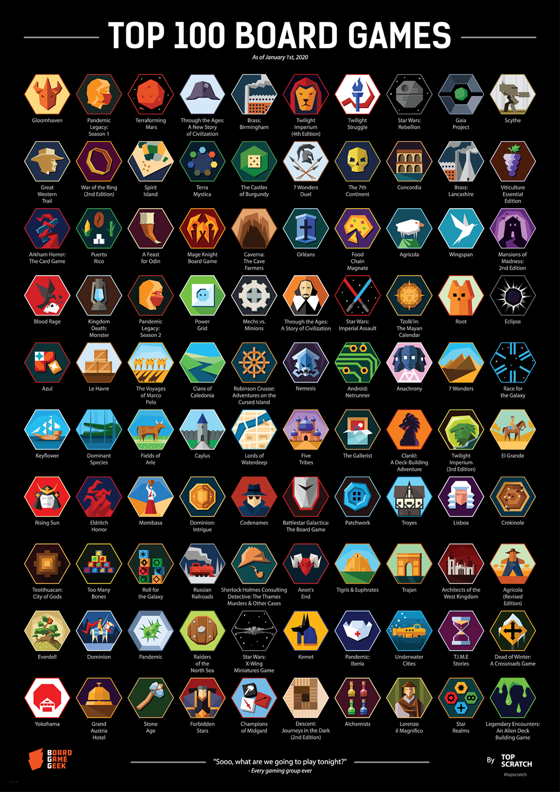

# System Design Interviews

## Resources

### Articles

* [Crack the System Design Interview](https://tianpan.co/notes/2016-02-13-crack-the-system-design-interview) - Tian Pan
* [Systems design for advanced beginners](https://robertheaton.com/2020/04/06/systems-design-for-advanced-beginners/) - Robert Heaton

### Books

* Building Microservices - Sam Newman
* Designing Data-Intensive Applications - Martin Kleppmann
* Domain-Driven Design - Eric Evans
* Microservice Patterns and Best Practices - Victor Feitosa Pacheco
* System Design Interview: An Insider's Guide - Alex Xu
  * [Volume 1](https://smile.amazon.co.uk/dp/B08B35X2ND)
  * [Volume 2](https://smile.amazon.co.uk/dp/1736049119/)
* Web Scalability for Startup Engineers - Artur Ejsmont

### Courses

* [Grokking the System Design Interview](https://www.educative.io/courses/grokking-the-system-design-interview) - educative.io
* [Grokking the Advanced System Design Interview](https://www.educative.io/courses/grokking-adv-system-design-intvw) - educative.io

### GitHub Repositories

* [FAANG System Design](https://github.com/neerazz/faang-system-design)
* [Latency Numbers Every Programmer Should Know](https://gist.github.com/jboner/2841832)
* [System Design Cheatsheet](https://gist.github.com/vasanthk/485d1c25737e8e72759f)
* [System Design Inteview for IT companies](https://github.com/checkcheckzz/system-design-interview)
* [System Design Interview Questions](https://github.com/sid24rane/System-Design-Interview-Questions)
* [System Design Primer](https://github.com/donnemartin/system-design-primer)

### Reddit Threads

* [How I approach Systems Design Interviews](https://www.reddit.com/r/ExperiencedDevs/comments/s5sw1h/how\_i\_approach\_systems\_design\_interviews/)

### Videos

* [How to Prepare for Technical Interviews, Part 2 - System Design](https://www.youtube.com/watch?v=9N2S3JZffeg) - Engineering with Utsav
* [Intro to Architecture and Systems Design Interviews](https://www.youtube.com/watch?v=ZgdS0EUmn70) - Jackson Gabbard
* [Want to Get Better at the System Design Interview? Start Here!](https://www.youtube.com/watch?v=XxB1BCuvu9A) - Engineering with Utsav

### Websites

* [High Scalability](http://highscalability.com/)

### YouTube channels

* [System Design Interview](https://www.youtube.com/c/SystemDesignInterview/videos)

### YouTube playlists

* [System Design](https://www.youtube.com/playlist?list=PLMCXHnjXnTnvo6alSjVkgxV-VH6EPyvoX) - Gaurav Sen
