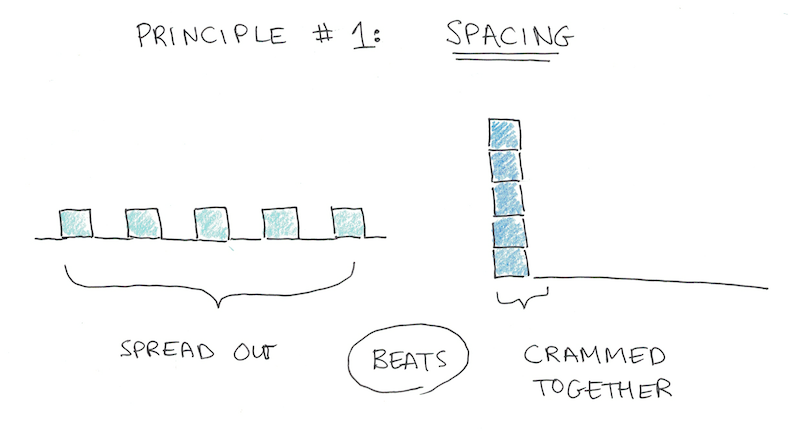
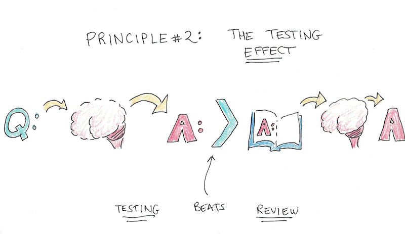
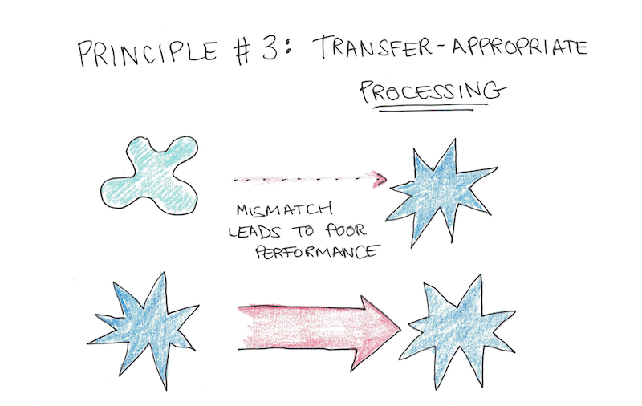
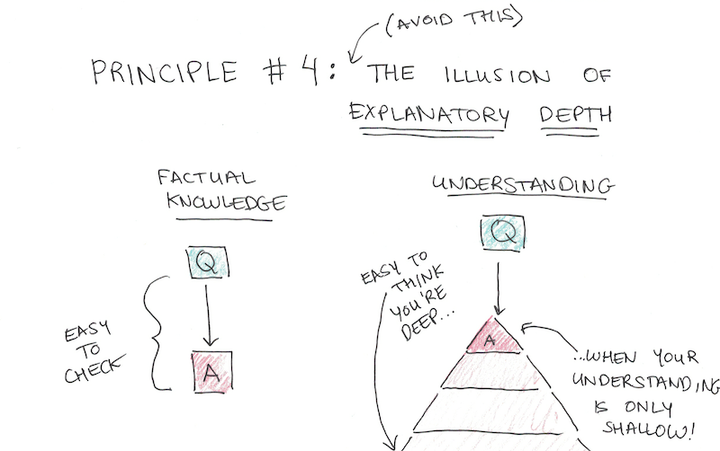
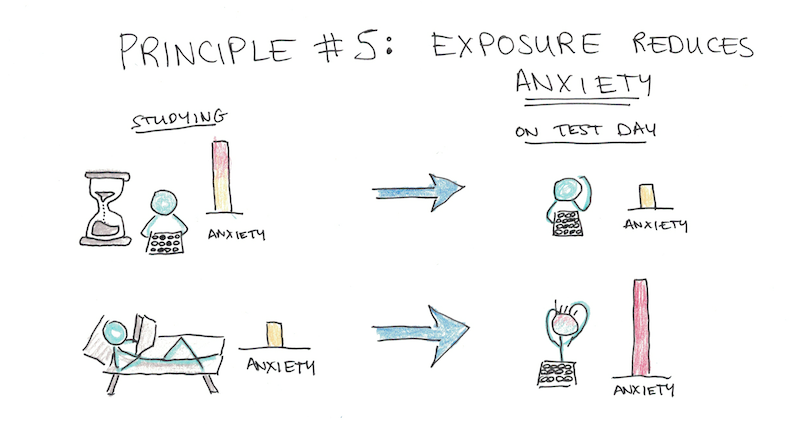

# Learning

## Notes

* The _spacing effect_ clearly shows that studying time is more efficient if it is spread out over multiple sessions than if it is compressed in one session. More exposures to information, separated in time, will result in better retention than if you cram them together in one burst.

* The _testing effect_ says that testing oneself, so you must retrieve the important information from memory, works better than re-reading notes or creating diagrams while referencing your textbook.

* There’s a strict hierarchy of what kinds of study materials will be most useful to you in preparing for your eventual exam:
  1. The most valuable are **mock tests and exams** which are intended to be identical in style and form to the test you’re actually going to take.
  2. Next are **problems**, given in homework assignments, textbook questions or quizzes, that are given for your class specifically.
  3. Finally, **self-generated questions or writing prompts** based on the material.
* The reason for this hierarchy of practice is known as _transfer-appropriate processing_. This basically means that the more your practice resembles the exam, the more your practice efforts will transfer into actual results.

* Memorization matters, but it’s more often as a means to understanding rather than an end in itself. This means that deeply understanding the core concepts behind any exam you study for should be a top priority.
* I recommend the [Feynman Technique](https://www.youtube.com/watch?v=FrNqSLPaZLc) as a tool for deepening your understanding of core concepts covered in the class. You’ll know something best when you can teach it.

* Anxiety is one-two punch for your studying ability. It’s both harder to concentrate and the stress makes it harder to remember things, even if you could.
* The solution is to make at least some of your studying sessions a full-blown simulation of the exam. If you have a few mock exams, I would save these for doing a full simulation of the test - same seating posture, materials and, most importantly, the same time constraints.

## Resources

### Articles

* [How Learning Works: Components, Systems, and Loops](https://romandesign.co/how-learning-works-components-systems-and-loops/) - Roman Kudryashov
* [Learning How to Learn: An Infographic](https://www.outerbridge.blog/articles/learning-how-to-learn-infographic) - outerbridge.blog
* [Teaching by filling in knowledge gaps](https://jvns.ca/blog/2021/09/20/teaching-by-filling-in-knowledge-gaps/) - Julia Evans
* [You Can Increase Your Intelligence: 5 Ways to Maximize Your Cognitive Potential](https://blogs.scientificamerican.com/guest-blog/you-can-increase-your-intelligence-5-ways-to-maximize-your-cognitive-potential/) - Andrea Kuszewski

### Books

* [The First 20 Hours - How to Learn Anything... Fast](https://smile.amazon.co.uk/First-20-Hours-Learn-Anything/dp/0670921920/) - Josh Kaufman

### Courses

* [Learning How To Learn ](https://www.coursera.org/learn/learning-how-to-learn)- Barbara Oakley

### Hacker News Threads

* [Do you have a process or a framework to learn specific skills quickly?](https://news.ycombinator.com/item?id=28017289)

### Websites

* [Academic Earth](https://academicearth.org)
* [Class Central](https://www.classcentral.com/)
* [CourseBuffet](https://www.coursebuffet.com/)
* [Coursera](https://www.coursera.org/)
* [CourseRoot](https://courseroot.com/) - Search 80,000 courses and tutorials
* [Degreed](https://degreed.com/)
* [Future Learn](https://www.futurelearn.com/)
* [HN Academy](https://yahnd.com/academy/) - The best online courses of Hacker News
* [Learn Anything](https://learn-anything.xyz/)
* [Lynda](https://www.lynda.com/)
* [MasterClass](https://www.masterclass.com/)
* [MIT OpenCourseWare](https://ocw.mit.edu/index.htm)
* [OpenCourser](https://opencourser.com/)
* [OpenLearn](https://www.open.edu/openlearn/)
* [OpenSesame](https://www.opensesame.com/)
* [Open Yale Courses](https://oyc.yale.edu/)
* [Quizlet](https://quizlet.com)
* [Saylor Academy](https://learn.saylor.org/)
* [SkillShare](https://www.skillshare.com/)
* [Springboard](https://www.springboard.com/)
* [StackSkills](https://stackskills.com/)
* [TakeLessons](https://takelessons.com/)
* [Udacity Nanodegrees](https://github.com/mikesprague/udacity-nanodegrees)
* [WiseGEEK](https://www.wisegeek.com/) - Clear answers to common questions
* [Wyzant](https://www.wyzant.com/) - Find private tutors
