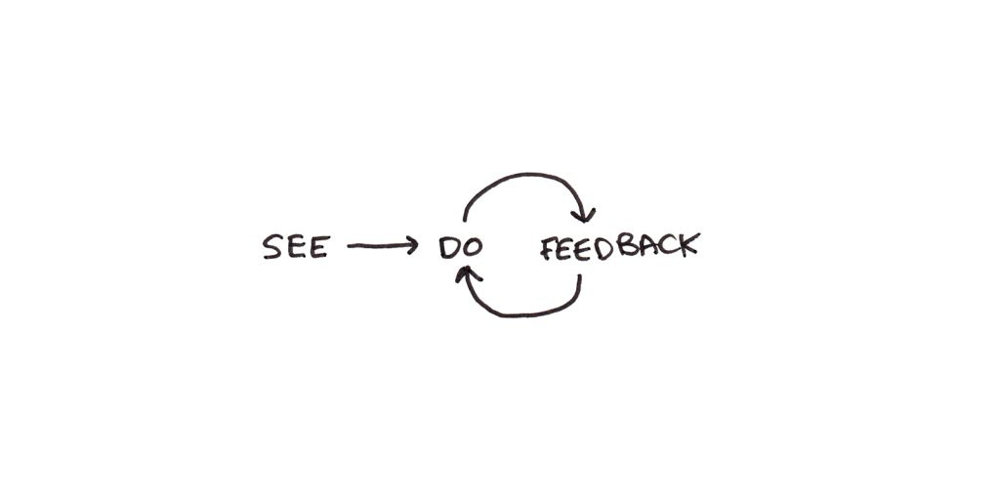

# Learning

## Notes

* The _spacing effect_ clearly shows that studying time is more efficient if it is spread out over multiple sessions than if it is compressed in one session. More exposures to information, separated in time, will result in better retention than if you cram them together in one burst.

* The _testing effect_ says that testing oneself, so you must retrieve the important information from memory, works better than re-reading notes or creating diagrams while referencing your textbook.

* There’s a strict hierarchy of what kinds of study materials will be most useful to you in preparing for your eventual exam:
  1. The most valuable are **mock tests and exams** which are intended to be identical in style and form to the test you’re actually going to take.
  2. Next are **problems**, given in homework assignments, textbook questions or quizzes, that are given for your class specifically.
  3. Finally, **self-generated questions or writing prompts** based on the material.
* The reason for this hierarchy of practice is known as _transfer-appropriate processing_. This basically means that the more your practice resembles the exam, the more your practice efforts will transfer into actual results.

* Memorization matters, but it’s more often as a means to understanding rather than an end in itself. This means that deeply understanding the core concepts behind any exam you study for should be a top priority.
* I recommend the [Feynman Technique](https://www.youtube.com/watch?v=FrNqSLPaZLc) as a tool for deepening your understanding of core concepts covered in the class. You’ll know something best when you can teach it.

* Anxiety is one-two punch for your studying ability. It’s both harder to concentrate and the stress makes it harder to remember things, even if you could.
* The solution is to make at least some of your studying sessions a full-blown simulation of the exam. If you have a few mock exams, I would save these for doing a full simulation of the test - same seating posture, materials and, most importantly, the same time constraints.

* The foundation for effective learning is _practice_, and good practice has three components:
  * **See**: look for an example of how to solve a problem - people don't solve problems by building general-purpose problem-solving skills, but by acquiring a ton of specific patterns of knowledge;
  * **Do**: solve the problem yourself - acquiring patterns is not enough, the knowledge needs to become an automatic skill in order to be useful;
  * **Feedback**: check whether you got the right answer - feedback is vital because it can correct for errors, can train your unconscious learning system, and can direct your future learning (to fix areas of weakness)

<figure><figcaption></figcaption></figure>

* How to take better notes:
  * Paraphrase, Don't Transcribe: frame the lecturer's words in your own words - this will force you to focus on understanding the meaning of what is being said;
  * Note Misunderstandings: take a note of all the concepts and questions that you don't immediately understand (write down timestamps, if you are watching a video) so you can follow up later;
  * Ask Questions: reframe the content presented in terms of the questions that might be asked about it - this is effective to identify the main principles

## Resources

### Articles

* [Expiring vs. Long-Term Knowledge](https://collabfund.com/blog/expiring-vs-lt-knowledge/) - Morgan Housel
* [How Learning Works: Components, Systems, and Loops](https://romandesign.co/how-learning-works-components-systems-and-loops/) - Roman Kudryashov
* [How to become an expert in anything?](https://newsletter.techworld-with-milan.com/p/how-to-become-an-expert-in-anything) - Dr Milan Milanović
* [How to Learn Anything Efficiently](https://newsletter.techworld-with-milan.com/p/how-to-learn-anything-efficiently) - Dr Milan Milanović
* [How to understand/retain complex concepts 10x better](https://learnhowtolearn.org/how-to-understand-and-retain-any-concept-10x-better/) - Learn How To Learn
* [Jerry Seinfeld, Ichiro Suzuki and the Pursuit of Mastery](https://www.readtrung.com/p/jerry-seinfeld-ichiro-suzuki-and) - Trung Phan
* [Josh Kaufman: It Takes 20 Hours Not 10,000 Hours To Learn A Skill](https://www.forbes.com/sites/danschawbel/2013/05/30/josh-kaufman-it-takes-20-hours-not-10000-hours-to-learn-a-skill/?sh=4b748b16363d) - Dan Schawbel, Forbes
* [Learn new skills](https://www.attejuvonen.fi/learn/) - Atte Juvonen
* [Learning How to Learn: An Infographic](https://www.outerbridge.blog/articles/learning-how-to-learn-infographic) - outerbridge.blog
* [Six Keys to Being Excellent at Anything](https://www.fastcompany.com/1686337/six-keys-being-excellent-anything) - Tony Schwartz, Fast Company
* [Teaching by filling in knowledge gaps](https://jvns.ca/blog/2021/09/20/teaching-by-filling-in-knowledge-gaps/) - Julia Evans
* [The Protégé Effect: Why teaching someone else is the best way to learn](https://ideas.time.com/2011/11/30/the-protege-effect/) - Annie Murphy Paul
* [The Step-by-Step Guide to Go From Novice to Expert in Any Skill](https://www.nateliason.com/blog/become-expert-dreyfus) - Nat Eliason
* [Write about what you learn. It pushes you to understand topics better.](https://addyosmani.com/blog/write-learn/) - Addy Osmani
* [You Can Increase Your Intelligence: 5 Ways to Maximize Your Cognitive Potential](https://blogs.scientificamerican.com/guest-blog/you-can-increase-your-intelligence-5-ways-to-maximize-your-cognitive-potential/) - Andrea Kuszewski

### Books

* [The First 20 Hours - How to Learn Anything... Fast](https://smile.amazon.co.uk/First-20-Hours-Learn-Anything/dp/0670921920/) - Josh Kaufman

### Courses

* [Learning How To Learn ](https://www.coursera.org/learn/learning-how-to-learn)- Barbara Oakley

### GitHub Repositories

* [Books](https://github.com/learn-anything/books) - Learn Anything
* [YouTube Channels & Other Resources](https://github.com/PrejudiceNeutrino/YouTube_Channels)

### Hacker News Threads

* [Do you have a process or a framework to learn specific skills quickly?](https://news.ycombinator.com/item?id=28017289)
* [Do you recall any book or course that made a topic finally click?](https://news.ycombinator.com/item?id=33593631)
* [Recommend me a course on Coursera](https://news.ycombinator.com/item?id=22826722)
* [Top Coursera Courses?](https://news.ycombinator.com/item?id=25245125)
* [What's the best lecture series you've seen?](https://news.ycombinator.com/item?id=34591291)
* [What are some of the best university courses available online for free?](https://news.ycombinator.com/item?id=35536042)
* [Which courses (online or not) have had the greatest impact on you?](https://news.ycombinator.com/item?id=34637678)

### Reddit Threads

* [What hobby doesn't require massive amount of time and money but is a lot of fun?](https://www.reddit.com/r/AskReddit/comments/5llwzm/what_hobby_doesnt_require_massive_amount_of_time/)
* [What is a hobby you can get into for almost no money?](https://www.reddit.com/r/AskReddit/comments/4knolu/what_is_a_hobby_you_can_get_into_for_almost_no/)
* [What skill can anyone independently learn in five hours?](https://www.reddit.com/r/AskReddit/comments/4xit3w/what_skill_can_anyone_independently_learn_in_five/)

### Tools

* [Anki](https://apps.ankiweb.net/)
  * [FSRS4Anki](https://github.com/open-spaced-repetition/fsrs4anki)
* [Quizlet](https://quizlet.com)
* [selfstudi.com](https://selfstudi.com/) - Turn YouTube Playlists into Courses for Self Study
* [Videocrawl Studio](https://www.videocrawl.dev/studio) - Summarise, fact check, and interact with any video content

### Websites

* [Academic Earth](https://academicearth.org)
* [Class Central](https://www.classcentral.com/)
* [CourseBuffet](https://www.coursebuffet.com/)
* [Coursera](https://www.coursera.org/)
* [CourseRoot](https://courseroot.com/) - Search 80,000 courses and tutorials
* [Crucial Exams](https://crucialexams.com/) - Free CompTIA, AWS, Microsoft practice test questions
* [Degreed](https://degreed.com/)
* [Explorable Explanations](https://explorabl.es/)
* [Future Learn](https://www.futurelearn.com/)
* [HN Academy](https://yahnd.com/academy/) - The best online courses of Hacker News
* [Learn Anything](https://learn-anything.xyz/)
* [Limnology](https://limnology.co/) - Top 70,000 Educational YouTube channels organized by category
* [Lynda](https://www.lynda.com/)
* [MasterClass](https://www.masterclass.com/)
* [Mind Luster](https://www.mindluster.com/)
* [MIT OpenCourseWare](https://ocw.mit.edu/index.htm)
* [OpenCourser](https://opencourser.com/)
* [OpenLearn](https://www.open.edu/openlearn/)
* [OpenSesame](https://www.opensesame.com/)
* [Open Yale Courses](https://oyc.yale.edu/)
* [Saylor Academy](https://learn.saylor.org/)
* [SkillShare](https://www.skillshare.com/)
* [Springboard](https://www.springboard.com/)
* [StackSkills](https://stackskills.com/)
* [Superprof](https://www.superprof.co.uk/)
* [TakeLessons](https://takelessons.com/)
* [The Great Courses](https://www.thegreatcourses.com/)
* [TutorChase](https://www.tutorchase.com/)
* [Udacity Nanodegrees](https://github.com/mikesprague/udacity-nanodegrees)
* [WiseGEEK](https://www.wisegeek.com/) - Clear answers to common questions
* [Wyzant](https://www.wyzant.com/) - Find private tutors

### YouTube Channels

* Andrew Huberman
  * [NEUROSCIENTIST: How To ACTUALLY LEARN](https://www.youtube.com/watch?v=sW0iNSrmcDQ)
    * Deliberate learning is a two-step process: engagement and focus, and deep rest
    * The best cycle for learning is a 90-minute session of deep focus, followed by a 20- or 30-minute naps within the following four hours, as this speeds up the brain rewiring by a factor of 10x to 20x
    * Gap learning effect: if you stop for about 10 seconds randomly during the 90-minute deep focus cycle, neurons will "replay" the new connection more often, leading to better learning
* [Tim Ferriss](https://www.youtube.com/@timferriss)
  * [The Tim Ferriss Experiment](https://www.youtube.com/playlist?list=PLuu6fDad2eJwnly_hEdir9biYcpG_MKMd)
