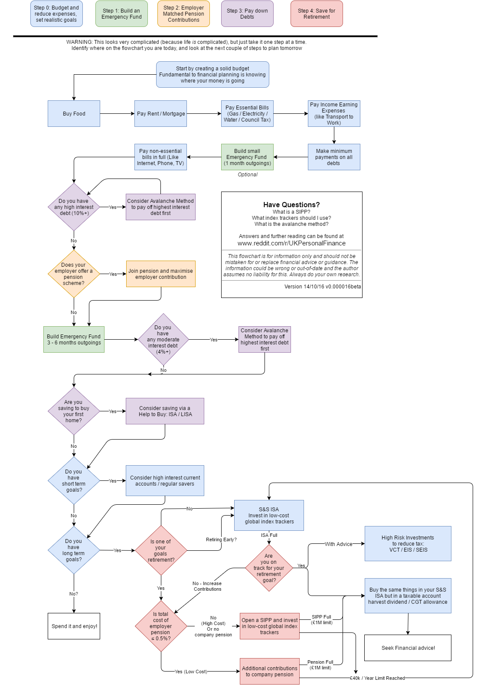

# Learning

## Resources

### Articles

* [How Learning Works: Components, Systems, and Loops](https://romandesign.co/how-learning-works-components-systems-and-loops/) - Roman Kudryashov
* [Learning How to Learn: An Infographic](https://www.outerbridge.blog/articles/learning-how-to-learn-infographic) - outerbridge.blog
* [Teaching by filling in knowledge gaps](https://jvns.ca/blog/2021/09/20/teaching-by-filling-in-knowledge-gaps/) - Julia Evans
* [You Can Increase Your Intelligence: 5 Ways to Maximize Your Cognitive Potential](https://blogs.scientificamerican.com/guest-blog/you-can-increase-your-intelligence-5-ways-to-maximize-your-cognitive-potential/) - Andrea Kuszewski

### Hacker News Threads

* [Do you have a process or a framework to learn specific skills quickly?](https://news.ycombinator.com/item?id=28017289)

### Websites

* [Academic Earth](https://academicearth.org)
* [Class Central](https://www.classcentral.com)
* [CourseBuffet](https://www.coursebuffet.com)
* [Coursera](https://www.coursera.org)
* [CourseRoot](https://courseroot.com) - Search 80,000 courses and tutorials
* [Degreed](https://degreed.com)
* [Future Learn](https://www.futurelearn.com)
* [HN Academy](https://yahnd.com/academy/) - The best online courses of Hacker News
* [Learn Anything](https://learn-anything.xyz)
* [Lynda](https://www.lynda.com)
* [MasterClass](https://www.masterclass.com)
* [MIT OpenCourseWare](https://ocw.mit.edu/index.htm)
* [OpenCourser](https://opencourser.com)
* [OpenLearn](https://www.open.edu/openlearn/)
* [OpenSesame](https://www.opensesame.com)
* [Open Yale Courses](https://oyc.yale.edu)
* [Quizlet](https://quizlet.com)
* [Saylor Academy](https://learn.saylor.org)
* [SkillShare](https://www.skillshare.com)
* [Springboard](https://www.springboard.com)
* [StackSkills](https://stackskills.com)
* [TakeLessons](https://takelessons.com)
* [Udacity Nanodegrees](https://github.com/mikesprague/udacity-nanodegrees)
