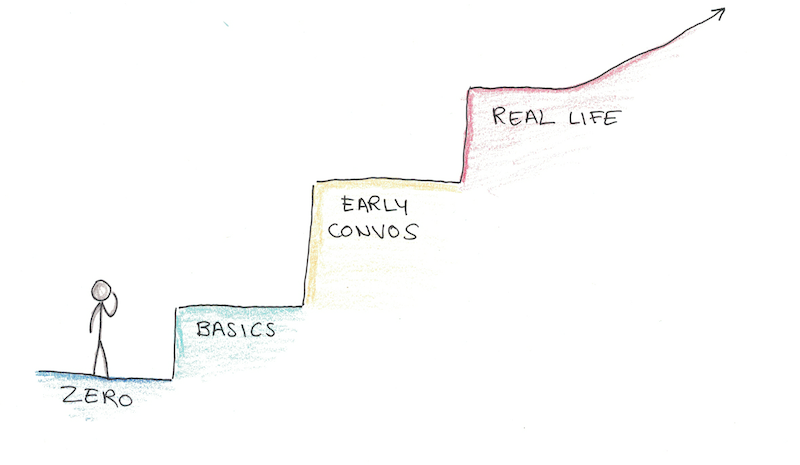

# Languages

## Notes

### How to learn a language in record time - Scott Young

* The better way to learn a language would have three phases:
  1. Acquiring the minimum basic knowledge and skills to start talking to people;
  2. Having structured, easy conversations in an environment that facilitates learning;
  3. Switching to immersive learning through actual interaction with people (or media).

#### Phase #1: Hitting the Minimum

* The first goal should be short and achievable - get to a level where you can struggle through your first 15-minute conversation, with the help of dictionaries and Google Translate.
* If you’re confident and willing to deal with awkwardness, this could potentially be reached in as little as thirty minutes.

#### Phase #2: Simple Conversations

* The next phase of your learning should be based on a mixture of actually speaking to someone and further deepening your knowledge of grammar and vocabulary.
* Next, you need to start off with a very specific kind of conversation in which you're going to explain that:
  1. You only want to speak in the language you’re learning (with rare exceptions)
  2. You’re going to use a dictionary and Google translate to fill gaps in your understanding
  3. You want them to write everything down that they’re saying, if you ask them. Both to help you learn it better, but also to copy into a dictionary to understand them
  4. You’ll tell them that you know it’s going to be awkward and slow, but you want them to be patient

#### Phase #3: Real Conversations

* If you go through this process, it shouldn’t be long before you’re able to have simple conversations about familiar topics that don’t immediately retreat to the dictionary.
* If you were planning an opportunity to travel to a place that speaks the language (or otherwise immerse yourself) now would be the time.

## Reources

### Apps

* [Anki](https://apps.ankiweb.net/)
* [Glossarie](https://glossarie.app/)
* [Vokabeln](https://vokabeln.io/)

### Articles

* [12 Rules for Learning Foreign Languages in Record Time](https://tim.blog/2014/03/21/how-to-learn-a-foreign-language-2/) - Tim Ferriss
* [How I Learned French in 12 Months](https://runwes.com/2020/02/11/howilearnedfrench.html) - Wesley Runnels
* [How to Learn Any Language in 3 Months](https://tim.blog/2009/01/20/learning-language/) - Tim Ferriss
* [How to Learn Any Language in Record Time and Never Forget It](https://tim.blog/2014/07/16/how-to-learn-any-language-in-record-time-and-never-forget-it/) - Gabriel Wyner
* [I Learned to Speak Four Languages in a Few Years: Here's How](https://lifehacker.com/i-learned-to-speak-four-languages-in-a-few-years-heres-5903288) - Gabriel Wyner, LifeHacker
* [The Most Effective Method for Learning a Language Alone](https://lifehacker.com/the-most-effective-method-for-learning-a-language-alone-5839401) - Dave MacLeod, LifeHacker
* [The Science of Learning a New Language (and How to Use It)](https://lifehacker.com/the-science-of-learning-a-new-language-and-how-to-use-1579130048) - Belle Beth Cooper, LifeHacker

### Blogs

* [Language category on Tim Ferriss's blog](https://tim.blog/category/language/)

### Books

* Fluent Forever - Gabriel Wyner
  * [Notes by Nat Eliason](https://www.nateliason.com/notes/fluent-forever-gabriel-weinberg)
* [Fluent In 3 Months](https://www.fluentin3months.com/) - Benny Lewis
  * [Summary by Four Minute Books](https://fourminutebooks.com/fluent-in-3-months-summary/)

### Videos

* [How to learn any language in six months](https://www.youtube.com/watch?v=d0yGdNEWdn0) - Chris Lonsdale
* [How to Learn Spanish in a Month](https://www.youtube.com/watch?v=aZke6Va7kJU) - Olav Schewe

### Websites

* [Couchsurfing](https://www.couchsurfing.com/)
* [Fluent In 3 Months](https://www.fluentin3months.com/)
* [Forvo](https://forvo.com/)
* [FSI Languages Courses](https://fsi-languages.yojik.eu/languages/oldfsi/index.html)
* [How To Learn Any Language](http://how-to-learn-any-language.com/e/index.html)
* [italki](https://www.italki.com/) - Find language tutors
* [I Will Teach You A Language](https://iwillteachyoualanguage.com/)
* [IPA Charts](https://www.yorku.ca/earmstro/ipa/index.html)
* [Language Transfer](https://www.languagetransfer.org/)
* [Learn A Language](https://www.learnalanguage.com/)
* [Lernu](https://lernu.net/it) - Learn Esperanto
* [LingQ](https://www.lingq.com/en/)
* [Memrise](https://www.memrise.com/)
* [Open Culture](https://www.openculture.com/freelanguagelessons) - Free Language Lessons
* [Readlang](https://readlang.com/) - Read, translate and supercharge your vocabulary
* [RhinoSpike](https://rhinospike.com/)
* [Rype](https://www.rypeapp.com/)
* [The Mimic Method](https://www.mimicmethod.com/)
* [Verbling](https://www.verbling.com/it) - Find language tutors

### YouTube Channels

* [Luca Lampariello](https://www.youtube.com/c/LucaLampariello/videos)
