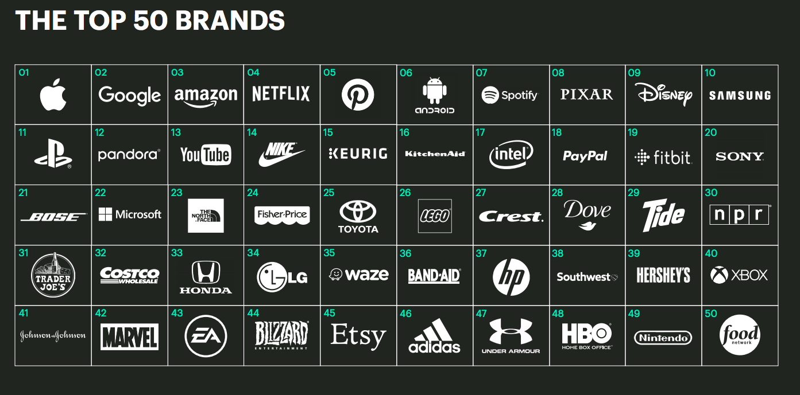

# Work

## Resources

### Articles

* [3 key tips for maximum impact, and what do Big Tech engineers even do?](https://newsletter.devmoh.co/p/3-key-tips-for-maximum-impact) - Priyam Mohanty
* [8 Hard Truths I learned when I got laid off from my SWE job](https://www.stevenbuccini.com/8-hard-truths-on-getting-laid-off) - Steven Buccini
* [10 questions to ask in a job interview that will really expose a company’s culture](https://www.fastcompany.com/90622890/10-questions-to-ask-in-a-job-interview-that-will-really-expose-a-companys-culture) - Karen Eber
* [15 Things Every Man Should Have in His Desk](https://www.artofmanliness.com/career-wealth/career/15-things-every-man-should-have-in-his-desk/) - The Art of Manliness
* [Create a Growth Culture, Not a Performance-Obsessed One](https://hbr.org/2018/03/create-a-growth-culture-not-a-performance-obsessed-one) - Tony Schwartz
* [Get your work recognized: write a brag document](https://jvns.ca/blog/brag-documents/) - Julia Evans
* [If Your Boss Could Do Your Job, You’re More Likely to Be Happy at Work](https://hbr.org/2016/12/if-your-boss-could-do-your-job-youre-more-likely-to-be-happy-at-work) - Benjamin Artz, Amanda Goodall, Andrew J. Oswald
* FAANG Career Ladder - Ryan Peterman
  * [Junior (L3) to Mid-level (L4)](https://www.developing.dev/p/faang-career-ladder-junior-l3-vs)
  * [Mid-level (L4) to Senior (L5)](https://www.developing.dev/p/faang-career-ladder-mid-level-l4)
  * [Senior (L5) vs Staff (L6)](https://www.developing.dev/p/faang-career-ladder-senior-l5-vs)
  * [Staff (L6) vs Senior Staff (L7)](https://www.developing.dev/p/faang-career-ladder-staff-l6-vs-senior)
* [How To Make Your Boss Adore You](https://www.askamanager.org/2014/08/how-to-make-your-boss-adore-you.html) - Ask A Manager
* [Mid Career Stuckness](https://www.subbu.org/articles/2023/mid-career-stuckness/) - Subbu Allamaraju
* Speedrunning Guide - Ryan Peterman
  * [Junior (L3) -> Mid-level (L4)](https://www.developing.dev/p/speedrunning-guide-l3-l4)
  * [Mid-level (L4) -> Senior (L5)](https://www.developing.dev/p/speedrunning-guide-mid-level-l4-senior)
  * [Senior (L5) -> Staff (L6)](https://www.developing.dev/p/speedrunning-guide-senior-l5-staff)
* [The Ask A Manager guide To Asking For A Raise](https://www.askamanager.org/2018/02/the-ask-a-manager-guide-to-asking-for-a-raise.html) - Ask A Manager
* [The best career advice I’ve received](https://humanwhocodes.com/blog/2013/10/15/the-best-career-advice-ive-received/) - Nicholas C. Zakas
* [The four-hour work day](https://ckarchive.com/b/27u2hohv3m877b3h4) - Oliver Burkeman
* [The Next Next Job, a framework for making big career decisions](https://andrewchen.com/the-next-next-job/) - Andrew Chen
* [The reality of Big Tech's 'fake work' problem](https://www.businessinsider.com/tech-industry-fake-work-problem-bad-managers-bosses-layoffs-jobs-2023-7?r=US\&IR=T) - Hugh Langley and Grace Key, Business Insider
* [Things your manager might not know](https://jvns.ca/blog/things-your-manager-might-not-know/) - Julia Evans
* [Up or Out: Solving the IT Turnover Crisis](https://thedailywtf.com/articles/up-or-out-solving-the-it-turnover-crisis) - Alex Papadimoulis
* [What does a CTO actually do?](https://vadimkravcenko.com/shorts/what-cto-does/) - Vadim Kravcenko
* [What Google Learned From Its Quest to Build the Perfect Team](https://www.nytimes.com/2016/02/28/magazine/what-google-learned-from-its-quest-to-build-the-perfect-team.html) - Charles Duhigg
* [Why The Status Quo Is So Hard To Change In Engineering Teams](https://www.okayhq.com/blog/status-quo-is-so-hard-to-change-in-engineering-teams) - Antoine Boulanger

### Hacker News Threads

* [Ask HN: Are you a “lifer”? If so why?](https://news.ycombinator.com/item?id=33794293)
* [Ask HN: How are the current layoffs affecting non-US developers?](https://news.ycombinator.com/item?id=34889624)
* [Ask HN: New job at BigCo. Everything has friction](https://news.ycombinator.com/item?id=31669338)
* [Ask HN: What companies have publicly available handbooks?](https://news.ycombinator.com/item?id=34959242)
* [Ask HN: What do you talk about in 1-on-1s with your managers?](https://news.ycombinator.com/item?id=34329351)
* [Ask HN: Who's not sucky to work for?](https://news.ycombinator.com/item?id=29099746)
* [Tell HN: I have the perfect job, why is it not enough?](https://news.ycombinator.com/item?id=32059666)

### Images

<figure><figcaption>
Top 50 Brands
</figcaption></figure>

### Videos

* [Rockstar Software Engineer Story: SW2 to Principal in 4 Years - How To Get Promoted FAST](https://www.youtube.com/watch?v=3\_Ue0tweDkE)

### Websites

* [50 Ways to Get a Job](https://50waystogetajob.com/)
* [Layoff Runbook](https://github.com/derwiki/layoff-runbook)
* [layoffs.fyi](https://layoffs.fyi/)
* [levels.fyi](https://www.levels.fyi/)
* [LinkedIn](https://it.linkedin.com/)
* [LinkedIn Skill Assessments](https://ebazhanov.github.io/linkedin-skill-assessments-quizzes/) ([GitHub](https://github.com/Ebazhanov/linkedin-skill-assessments-quizzes))
* [promotions.fyi](https://www.promotions.fyi/)
* [We've all faced rejection](https://rejected.us/)
* [You Got This!](https://yougotthis.io/)

### Workplaces

* [CoWorking.Coffee](https://www.coworking.coffee/)
* [Workmode](https://workmode.co/)

